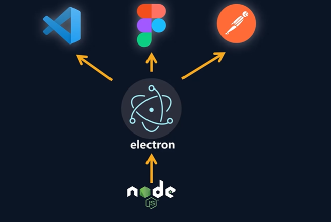
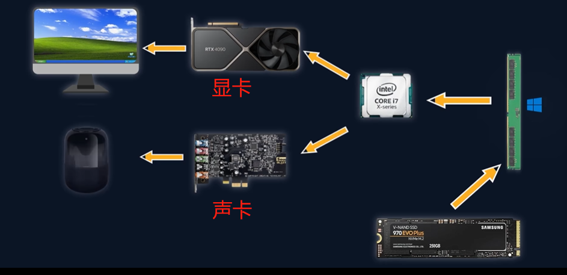

# NodeJS入门

## Node.js基础

### 为什么要学习Node.js?

1. 可以其他人访问我们编写的网页。

2. 为后续的框架学习打基础。

   前端开发三大框架：Vue、React、Angular，这三个框架开发离不开node.js

### Node.js是什么？

官方定义：Node.js是一个开源的，跨平台的JavaScript运行环境。

通俗来说，Node.js是一款应用程序，是一款软件，它可以运行JavaScript。

### Node.js的作用？

1. 开发服务端应用

   

   服务器中光有硬件是不行的，需要软件来实现客服端和服务端之间的通信，node.js就是这样一款软件。

   要想让每个人都看到写好的网页，就需要把资源放在服务器上。

2. 开发工具类应用

   Webpack、Vite、Babel

3. 开发桌面端应用

   electron框架可以开发桌面端应用，electron框架基于Node.js

   

### 下载安装Node.js

官网：https://nodejs.org/en/download

全部安装包：https://registry.npmmirror.com/binary.html?path=node/v18.16.0/ 

LTS版本：long time service 长期维护的版本

node.js这个软件没有桌面快捷方式，如何查看是否安装成功？cmd 输入`node -v`


## 命令行工具

命令行的语法：命令 参数1 ··· 参数n

```shell
# 在cmd中:使用谷歌浏览器打开百度首页
chrome http://www.baidu.com
# 在cmd中:使用谷歌浏览器打开百度和京东的首页
chrome http://www.baidu.com http://www.jd.com
```

常用命令：


`d：`命令行工作目录切换到d盘

`dir`显示文件夹内容  

`dir /s`查看当前路径下的所有文件和文件夹以及子目录下的文件。

`cd`切换目录

`cd .. `切换到上一级目录

`ctrl+c`停止命令行输出 

- 可以使用电脑原生的cmd

- 也可以使用vscode的终端

  操作方法：右键选中要执行的文件，点击在集成终端中打开

  


## 注意事项


1. Node.js中不能使用BOM和DOM的API，可以使用console和定时器API

2. Node.js中的顶级对象为global,也可以使用globalThis访问顶级对象。

   相当于在浏览器当中的window对象

## buffter介绍

buffer缓冲区：类似数组的对象，用于表示**固定长度的字节序列**

简单来说,buffter是一段固定长度内存空间，用来存储二进制空间。

特点：

- buffer大小固定且无法调整
- Buffer性能较好,可以直接对计算机内存进行操作
- 每个元素的大小占8位，一个字节

buffer的作用：

- buffer在内存中预留出指定大小的存储空间，对输入/输出（简称IO）进行数据的临时存储

- 缓冲，缓和对输出设备的冲击

  如果每秒要写100次磁盘，需要花费大量时间处理开始写和结束写这两件事

  如果使用buffer暂存起来，变成没10s写一次硬盘，对系统的冲击就很小。

https://www.bilibili.com/video/BV1gM411W7ex?p=12&spm_id_from=pageDriver&vd_source=dde2f4dd432156027fedf9b1734ba705

## 计算机基本组成

### 计算机的组成

CPU：

内存：存储数据。读写速度快，断电丢失数据，数据只有进入内存才能与cpu交互

硬盘：存储数据。读写速度慢，断点不丢失数据

主板：大的集成电路板，通过插槽集成各个硬件，

显卡：处理视频信息，显示信息都交给显卡处理。

### 程序基本运行流程

操作系统也是一种应用程序，用来管理和调度计算机的软硬件资源。



cpu在处理时如果遇到了视频信息就交给显卡进行处理，遇到了声音信息就交给声卡处理。

程序一般保存在硬盘中，软件安装的过程就是将程序写入到硬盘的过程；程序在运行时会加载进入内存，然后由CPU读取并执行程序。

### 进程与线程

进程：程序的一次的执行过程，（从动态的角度来说，与静态的程序进行了区分）

线程：一个进程中执行的一个执行流、一个线程是属于某个进程的


一个进程中至少有一个线程，可以有多个。


